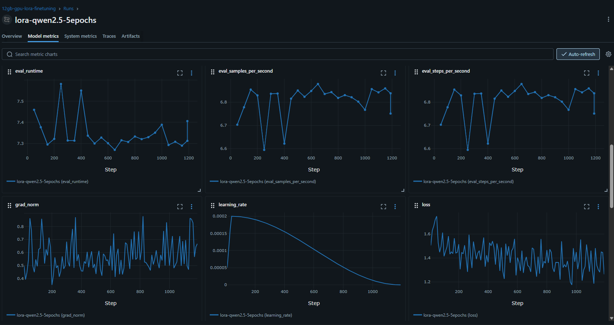

# LLM Fine-Tuning Pipeline

End-to-end local LoRA fine-tuning pipeline for a compact chat model, built for GPU-constrained training, MLflow tracking.

## What this project shows

- 4-bit loading with QLoRA-style training
- LoRA adapter fine-tuning on a conversational dataset
- MLflow experiment tracking with training and eval metrics
- Saved adapter artifacts for repeatable inference
- A lightweight local workflow that runs on a single consumer GPU (Trained on RTX 3060 12gb)

## Project structure

- `src/train.py` - loads the base model, trains the LoRA adapter, and logs results to MLflow
- `src/inference.py` - loads the trained adapter for interactive generation
- `docker-compose.yaml` - starts a local MLflow server
- `data/sample_dataset.jsonl` - example dataset used for local experiments
- `lora_adapter/` - saved adapter artifacts

## Prerequisites

- Docker compose
- Python 3.12
- A CUDA-capable NVIDIA GPU
- The virtual environment created for this repository

## Setup

1. Start MLflow:

	```bash
	docker compose up -d
	```

2. Activate the virtual environment:

	```bash
	source .venv/bin/activate
	```

3. Install dependencies if needed:

	```bash
	uv sync
	```

## Train the adapter

Run the training script:

```bash
python src/train.py
```

During training, MLflow logs:

- training loss
- evaluation loss
- hyperparameters
- saved adapter artifacts
- a sample generation example

The current training script is configured to run for multiple epochs, split data into train and eval sets, and save the best checkpoint.

## Run inference

After training, launch the interactive inference script:

```bash
python src/inference.py
```

It loads the base model in 4-bit, attaches the saved LoRA adapter, and lets you test prompts locally.

## MLflow

Open the local tracking UI at:

http://localhost:5000

Use it to review runs, compare metrics, and inspect logged artifacts.

Example tracking after 1 hour LoRA train:



## Notes

This project is designed to communicate the following skills clearly:

- practical LLM fine-tuning
- GPU memory-aware training
- experiment tracking and reproducibility
- adapter-based deployment workflows
- local MLOps tooling
